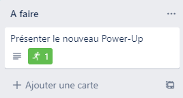
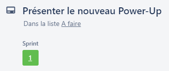
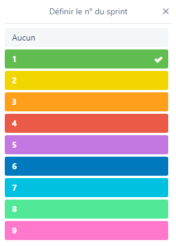
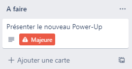
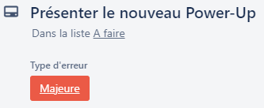
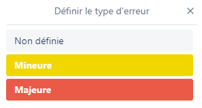

# Introduction

Ce projet contient les power-ups Trello développés par DAVIDSON EST, uniquement dédié à un usage interne. On retrouve parmi eux :

- sprint-number : indique le numéro de sprint d'une carte
- error-type : indique le type d'erreur d'une carte

Ils respectent tous la même structure de fichier. En supposant que je souhaite créer un nouveau power-up `new-power-up`, il contiendra les fichiers suivants :

```
- public
  - docs
    - new-power-up
      - badge-card.png (image pour le README.md) 
  - images
    - icon_xx.png
  - js
    - new-power-up
      - client.js 
      - iframe.js
  - styles
    - new-power-up.css (optionnel)
  - views
    - new-power-up
      - iframe.html
      - index.html (point d'entrée pour la chargement côté Trello)
```
En terme d'ordonnancement, on retrouve la logique suivante :

1. Trello charge le fichier `index.html` (routage défini dans `server.js`)
2. `index.html` charge le SDK de Trello ainsi que le fichier `client.js` 
3. `client.js` charge le fichier `iframe.html` lors d'une action
4. `iframe.html`  charge les fichiers `iframe.js` et `*.css` 

Le fichier `client.js` contient la définition du power-up ainsi que la logique pour les différentes capacités (badges de la carte, boutons de la carte, badges de détails de la carte, etc.).

# Installation

Pour installer un power-up personnalisé, il faut se rendre sur le panneau de configuration des power-ups (https://trello.com/power-ups/admin) et en créer un nouveau. Trello fourni un guide détaillé disponible [ici](https://developer.atlassian.com/cloud/trello/guides/power-ups/managing-power-ups/).

Attention, l'ajout d'un power-up est lié à un espace de travail. Il est donc nécessaire de répeter cette opération sur l'ensemble des espaces de travail où ces power-ups sont nécessaires.

## Sprint Number 🏃

#### Captures d'écran







#### Configuration

- Informations de base
  - URL du connecteur iframe : https://a-definir.herokuapp.com/sprint-number
  - Icône : https://a-definir.herokuapp.com/images/icon_sprint.png
  - Catégories : Informatique et gestion de projet / Utilitaires du tableau
  - E-mail : luc.dehand@davidson.fr
  - Contact : luc.dehand@davidson.fr
  - Auteur : DAVIDSON EST
- Capacités
  - Badges de la carte : à activer
  - Boutons de la carte : à activer
  - Badges de détails de la carte : à activer
- Listes
  - Langue : Français
  - Nom : Sprint Number
- Confidentialité et conformité
  - Votre power-up conserve-t-il les données personnelles d'un utilisateur Trello ? : Non


## Error Type ⚠️

#### Captures d'écran







#### Configuration

- Informations de base
  - URL du connecteur iframe : https://a-definir.herokuapp.com/error-type
  - Icône : https://a-definir.herokuapp.com/images/icon_error.png
  - Catégories : Informatique et gestion de projet / Utilitaires du tableau
  - E-mail : luc.dehand@davidson.fr
  - Contact : luc.dehand@davidson.fr
  - Auteur : DAVIDSON EST
- Capacités
  - Badges de la carte : à activer
  - Boutons de la carte : à activer
  - Badges de détails de la carte : à activer
- Listes
  - Langue : Français
  - Nom : Error Type
- Confidentialité et conformité
  - Votre power-up conserve-t-il les données personnelles d'un utilisateur Trello ? : Non